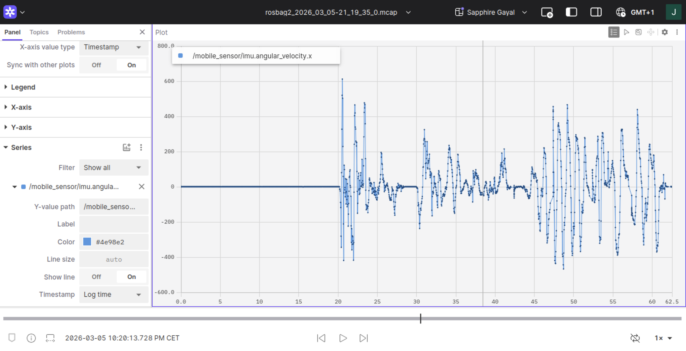

# foxglove-rosbags-guide

A practical guide for recording ROS2 bag files and visualizing them in Foxglove.

---

## Overview

This guide covers:

- Recording ROS2 sensor data into **rosbag**
- Visualizing recorded data in **Foxglove**
- Using a **smartphone as a ROS2 sensor source**

---

## Prerequisites

### Requirements

- ROS2 (tested with Humble)
- Foxglove Studio
- rosbag2

Additional components used in this setup:

- Smartphone for sensor streaming
- ROS2 mobile sensor bridge  
  (see repository: [ROS2 Mobile Sensor Bridge](https://github.com/VedantC2307/ros2-mobile-sensor-bridge))

---

## Installation

### 1. Build Docker Image

Build the Docker image using the provided [Dockerfile](./Dockerfile):

```bash
docker build \
--build-arg UID=$(id -u) \
--build-arg GID=$(id -g) \
--build-arg UNAME=$(whoami) \
-t ros2-humble-custom .
```

### 2. Run Docker Container

Start the container:

```bash
docker run -it \
--network=host \
-d \
-v /tmp/.X11-unix:/tmp/.X11-unix \
--name ros2-humble-custom \
-e DISPLAY=${DISPLAY} \
ros2-humble-custom
```

Enter the running container:

```bash
docker exec -it ros2-humble-custom /bin/bash
```

### 3. Setup ROS2 Workspace

Inside the container, create a ROS2 workspace and a `src` folder:

```bash
mkdir -p ~/ros2_ws/src
cd ~/ros2_ws
```

### 4. Install Node.js

Install **nvm (Node Version Manager)**:

```bash
curl -o- https://raw.githubusercontent.com/nvm-sh/nvm/v0.39.7/install.sh | bash
```

Reload the shell configuration:

```bash
source ~/.bashrc
```

Install the latest LTS version of Node.js:

```bash
nvm install --lts
```

### 5. Install ROS2 Mobile Sensor Bridge

Follow the installation guide in the repository:

[ROS2 Mobile Sensor Bridge](https://github.com/VedantC2307/ros2-mobile-sensor-bridge)

Launch the mobile sensor node:

```bash
ros2 launch mobile_sensor mobile_sensors.launch.py
```

---

## Usage

### Recording ROS2 Data

Once the mobile sensor bridge is running and publishing topics, record the data of a specific topic, for example:

```bash
ros2 bag record -s mcap /mobile_sensor/imu
```

Stop the recording with:

```
Ctrl + C
```

### Run Foxglove Bridge

```bash
ros2 run foxglove_bridge foxglove_bridge
```

### Visualize Data in Foxglove

Open Foxglove Studio in your browser and sign in:

[Foxglove Studio](https://app.foxglove.dev/signin)

1. Navigate to **Browse -> Recordings**
2. Import your rosbag in **MCAP format**
3. Open the recording to visualize the data

### Example

Visualization of IMU data (angular_velocity.x):




